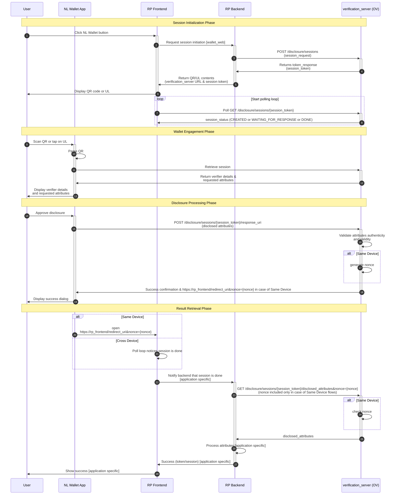

# Disclosure Session Sequence Diagram

## Session States

- **CREATED**: Session has been created and is awaiting user action
- **WAITING_FOR_RESPONSE**: User is interacting with wallet, waiting for response
- **DONE**: Session is complete with one of the following substates:
  - **SUCCESS**: Attributes were successfully disclosed and validated
  - **FAILED**: Validation or other infrastructure issues
  - **CANCELED**: User rejected the disclosure request
  - **EXPIRED**: User took too long to respond

## Key API Endpoints

### Private API (Requester)
- `POST /disclosure/sessions` - Initialize a new disclosure session
- `GET /disclosure/sessions/{session_token}/disclosed_attributes` - Retrieve disclosed attributes after successful validation

### Public API (Wallet)
- `GET /disclosure/sessions/{session_token}` - Check session status
- `POST /disclosure/sessions/{session_token}/request_uri` - Device engagement request
- `POST /disclosure/sessions/{session_token}/response_uri` - Device response with disclosed attributes

## Components

- **User**: Person initiating the verification/disclosure
- **RP Frontend**: Relying party's frontend (JavaScript/HTML/CSS), may use wallet_web library
- **RP Backend**: Relying party's backend server
- **Verification Server**: NL Wallet verification server component (OV - Ontvangende Voorziening)
- **NL Wallet App**: NL Wallet mobile application
